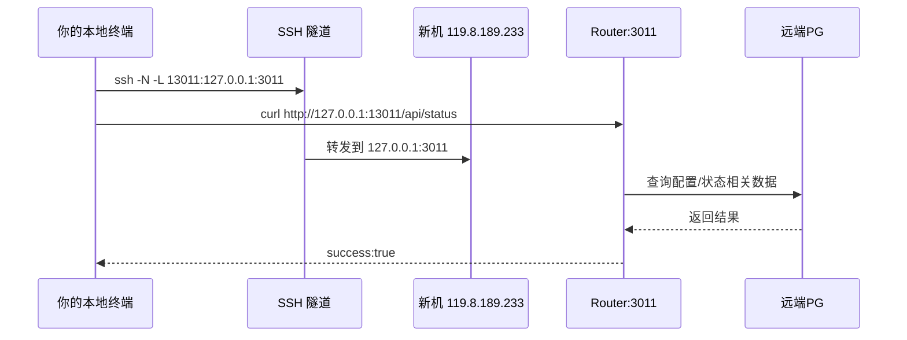

# SSH 端口转发教学：不改公网配置，先本地模拟访问

> 目标：在不改 DNS / 证书 / Nginx 公网入口的前提下，通过 SSH 隧道验证新机上的 Router。
>
> 目标新机 IP：`119.8.189.233`

---

## 1. 你要用哪种方式

### 方式 A（推荐，最稳）

- 直接把新机的 Router 端口 `3011` 转发到你本地。
- 适合验证：服务是否起来、接口是否可用、是否连到 PG。

### 方式 B（更接近公网）

- 把新机的 `443` 转发到你本地高位端口（如 `18443`）。
- 适合验证：Nginx 反代链路、HTTPS 头、Host 路由。

---

## 2. 概念图（你在本地看起来像“公网”）


---

## 3. 方式 A：转发 Router 3011（首选）

在你的本地电脑执行：

```bash
ssh -N -L 13011:127.0.0.1:3011 root@119.8.189.233
```

说明：

- `-L 13011:127.0.0.1:3011`：把你本地 `13011` 映射到新机 `127.0.0.1:3011`
- `-N`：只建隧道，不开远程 shell

另开一个本地终端验证：

```bash
curl -s http://127.0.0.1:13011/api/status
```

如果你要模拟“域名访问头”（很多网关逻辑会看 `Host`）：

```bash
curl -s -H 'Host: shengnw.win' http://127.0.0.1:13011/api/status
```

浏览器访问：

- `http://127.0.0.1:13011`

---

## 4. 方式 B：转发 443，模拟 HTTPS 访问

在你的本地电脑执行：

```bash
ssh -N -L 18443:127.0.0.1:443 root@119.8.189.233
```

然后本地请求（保留 SNI/Host 为域名）：

```bash
curl -I --resolve shengnw.win:18443:127.0.0.1 https://shengnw.win:18443
```

若证书域名不匹配，临时忽略证书校验：

```bash
curl -k -I --resolve shengnw.win:18443:127.0.0.1 https://shengnw.win:18443
```

---

## 5. 验证链路是否“真的连到 PG”

不管方式 A/B，都建议在新机上看：

```bash
journalctl -u router --since 'today' --no-pager | rg "openPostgreSQL|openSQLite|openMySQL" -S
```

必须出现：

- `openPostgreSQL`

如果出现 `openSQLite`，说明配置没吃到（通常是 `WorkingDirectory` 或 `SQL_DSN` 问题）。

---

## 6. 常用排障

### 6.1 本地端口被占用

换本地端口，例如把 `13011` 改成 `23011`。

### 6.2 隧道已连，但请求失败

先在新机本地测：

```bash
curl -s http://127.0.0.1:3011/api/status
```

如果这都不通，先修 Router 服务本身。

### 6.3 SSH 隧道经常断

可加保活参数：

```bash
ssh -N \
  -o ServerAliveInterval=30 \
  -o ServerAliveCountMax=3 \
  -L 13011:127.0.0.1:3011 \
  root@119.8.189.233
```

---

## 7. 一张顺序图：你每一步在做什么



---

## 8. 推荐最小验证命令（可直接复制）

### 本地电脑

```bash
ssh -N -L 13011:127.0.0.1:3011 root@119.8.189.233
```

### 另一个本地终端

```bash
curl -s http://127.0.0.1:13011/api/status
```

### 新机（确认 PG）

```bash
journalctl -u router --since 'today' --no-pager | rg "openPostgreSQL|openSQLite|openMySQL" -S
```

