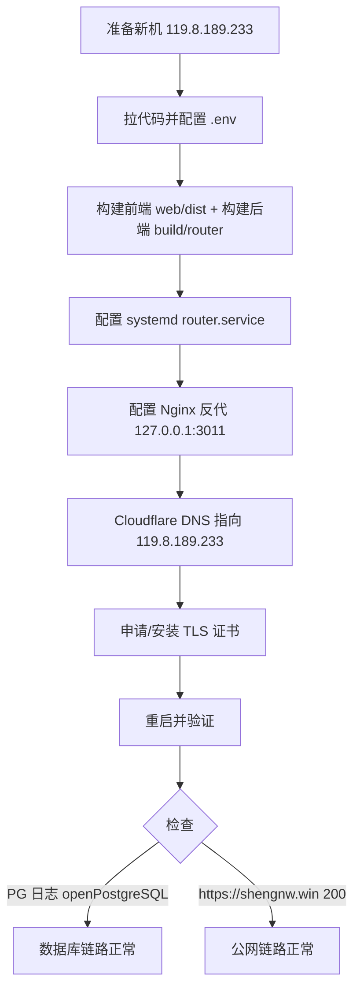
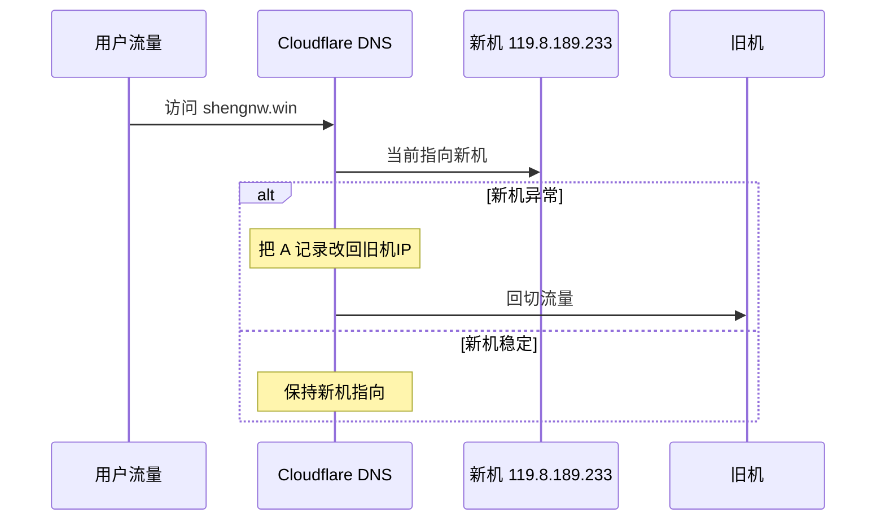

# `shengnw.win` 新机公网部署与 PG 复用手册（Router）

> 目标：把 Router 在新机器 `119.8.189.233` 上公网拉起，域名使用 `shengnw.win`，并复用现有 PostgreSQL（不搬数据，只切连接）。
>
> 适用仓库路径：`/root/code/router/router_new`
>
> 本文定位：新开 Codex 或人类同事直接照抄即可落地。

---

## 1. 一句话结论

1. 这是一次“服务迁移 + DNS 切流”，不是数据库数据迁移。
2. PG 保持在原机器不动；新机器只需要正确配置 `SQL_DSN` 并确保网络/权限可达。
3. 公网可用的核心链路：`Cloudflare DNS -> shengnw.win -> 新机 Nginx(443) -> 127.0.0.1:3011 -> Router -> 远端 PG`。

---

## 2. 主线总览（先看这个）



---

## 3. 架构与概念（避免误解）

### 3.1 运行架构


### 3.2 这次“迁移”到底迁什么

- 迁移的是：`应用运行位置` 与 `公网入口`。
- 不迁移的是：`PG 数据本体`。
- 关键动作是：新机 `SQL_DSN` 指向旧 PG；Router 启动后自动做 schema 对齐（`AutoMigrate`）。

### 3.3 为什么要强调 WorkingDirectory

项目入口通过 `godotenv/autoload` 自动加载 `.env`。如果 `systemd WorkingDirectory` 不是仓库根目录，可能读不到 `.env`，导致：

- `SQL_DSN` 丢失 -> 回落 SQLite。
- 其他环境变量缺失 -> 行为偏差。

---

## 4. 前置清单（上线前）

- 新机已可 SSH：`119.8.189.233`
- 代码已拉取：`/root/code/router/router_new`
- 远端 PG 已运行且允许新机访问（防火墙 + `pg_hba.conf`）
- 域名托管在 Cloudflare，并可访问：
  - `https://dash.cloudflare.com/40dbe0608f40945fa0bebcf82a92bbe0/home/domains`

---

## 5. 新机部署步骤（可直接执行）

### 5.1 依赖安装

```bash
apt-get update
apt-get install -y nginx certbot python3-certbot-nginx postgresql-client
```

安装 Go/Node（若未安装）：

- Go >= 1.22
- Node >= 18（建议 LTS）

---

### 5.2 配置 `.env`（核心）

在 `/root/code/router/router_new/.env` 写入至少这些项（示例）：

```bash
PORT=3011
SESSION_SECRET=请替换为高强度随机串
WALLET_JWT_SECRET=请替换为高强度随机串

# 关键：复用旧 PG
SQL_DSN=postgres://<user>:<password>@<old_pg_host>:5432/<db_name>?sslmode=disable

# 可选：日志库不分离时不要填 LOG_SQL_DSN
# LOG_SQL_DSN=

# 钱包相关（按你现网策略）
AUTO_REGISTER_ENABLED=true
UCAN_AUD=did:web:shengnw.win

# 如启用 CORS 白名单，务必包含新域名
CORS_ALLOWED_ORIGINS=https://shengnw.win,https://www.shengnw.win
```

先测 PG 连通性：

```bash
psql "postgres://<user>:<password>@<old_pg_host>:5432/<db_name>?sslmode=disable" -c 'select now();'
```

---

### 5.3 构建前后端

> 当前仓库前端构建产物为 `web/dist`，并通过 `embed.go` 打进后端二进制。

```bash
cd /root/code/router/router_new
npm ci --prefix web
npm run build --prefix web
mkdir -p build
go build -o build/router ./cmd/router
```

---

### 5.4 配置 systemd

创建 `/etc/systemd/system/router.service`：

```ini
[Unit]
Description=Router Service
After=network.target

[Service]
User=root
WorkingDirectory=/root/code/router/router_new
ExecStart=/root/code/router/router_new/build/router --port 3011 --log-dir ./logs
Restart=on-failure
RestartSec=5

# 可直接放关键环境变量；也可改为 EnvironmentFile
Environment=TIKTOKEN_CACHE_DIR=/root/code/router/router_new/.tiktoken_cache
Environment=GEMINI_VERSION=v1beta
Environment=UCAN_AUD=did:web:shengnw.win
Environment=AUTO_REGISTER_ENABLED=true

StandardOutput=journal
StandardError=journal

[Install]
WantedBy=multi-user.target
```

生效并启动：

```bash
systemctl daemon-reload
systemctl enable --now router
systemctl status router --no-pager
```

---

### 5.5 配置 Nginx（`shengnw.win`）

创建 `/etc/nginx/conf.d/router.conf`：

```nginx
server {
    listen 80;
    server_name shengnw.win www.shengnw.win;
    return 301 https://$host$request_uri;
}

server {
    listen 443 ssl http2;
    server_name shengnw.win www.shengnw.win;

    ssl_certificate /etc/letsencrypt/live/shengnw.win/fullchain.pem;
    ssl_certificate_key /etc/letsencrypt/live/shengnw.win/privkey.pem;
    include /etc/letsencrypt/options-ssl-nginx.conf;
    ssl_dhparam /etc/letsencrypt/ssl-dhparams.pem;

    add_header Strict-Transport-Security "max-age=63072000; includeSubDomains; preload";
    add_header X-Content-Type-Options nosniff;
    add_header X-Frame-Options DENY;
    add_header X-XSS-Protection "1; mode=block";
    add_header Referrer-Policy "no-referrer-when-downgrade";

    location / {
        proxy_pass http://127.0.0.1:3011;
        proxy_http_version 1.1;

        proxy_set_header Host $host;
        proxy_set_header X-Real-IP $remote_addr;
        proxy_set_header X-Forwarded-For $proxy_add_x_forwarded_for;
        proxy_set_header X-Forwarded-Proto $scheme;

        proxy_set_header Upgrade $http_upgrade;
        proxy_set_header Connection "upgrade";
    }
}
```

检查并重载：

```bash
nginx -t
systemctl reload nginx
```

---

### 5.6 Cloudflare 配置（把域名指到新机）

入口：`https://dash.cloudflare.com/40dbe0608f40945fa0bebcf82a92bbe0/home/domains`

在 `shengnw.win` 的 DNS 页面配置：

1. `A` 记录
   - Name: `@`
   - IPv4: `119.8.189.233`
   - TTL: `Auto`
   - Proxy status: `DNS only`（灰云，先用它申请证书）
2. `CNAME` 记录
   - Name: `www`
   - Target: `shengnw.win`
   - TTL: `Auto`
   - Proxy status: `DNS only`

验证解析：

```bash
dig +short shengnw.win A
dig +short www.shengnw.win CNAME
```

预期包含：`119.8.189.233`

---

### 5.7 申请证书

DNS 生效后执行：

```bash
certbot --nginx -d shengnw.win -d www.shengnw.win
```

成功后再次检查：

```bash
nginx -t
systemctl reload nginx
```

> 若后续你希望走 Cloudflare 代理（橙云），建议 SSL/TLS 模式设为 `Full (strict)`，避免回源明文。

---

## 6. PG 复用与“迁移”说明（重点）

### 6.1 数据迁移策略

- 本次不做数据导出/导入。
- 应用直接连接旧 PG 库，复用历史数据。
- Router 启动时会执行 `AutoMigrate`，必要时补 sequence/default（例如 `logs.id`, `redemptions.id`）。

### 6.2 账号权限建议

推荐使用拥有目标 schema 变更权限的 DB 用户（至少可 `CREATE/ALTER` 相关对象），否则首启可能在 migration 阶段失败。

最小风险建议：

1. 使用已在旧机线上运行过 Router 的同一 DB 账号。
2. 首启前在新机先跑 `psql` 连通性测试。
3. 首启后立即查日志是否有 migration error。

### 6.3 验证是否真的连上 PG（而非 SQLite）

```bash
journalctl -u router --since 'today' --no-pager | rg "openPostgreSQL|openSQLite|openMySQL" -S
```

必须看到：`openPostgreSQL`。

---

## 7. 切换与验证清单（上线验收）

### 7.1 服务层

```bash
systemctl status router --no-pager
curl -s http://127.0.0.1:3011/api/status
```

预期：`success:true`

### 7.2 公网层

```bash
curl -I https://shengnw.win
curl -I https://www.shengnw.win
```

预期：`HTTP/1.1 200 OK`（或可接受的 301 -> 200 跳转）

### 7.3 数据层

```bash
journalctl -u router -n 200 --no-pager | rg -n "openPostgreSQL|database migrated|failed|error" -S
```

预期：

- 出现 `openPostgreSQL`
- 无启动阶段致命错误

---

## 8. 故障定位速查

- 现象：公网 502
  - 排查：`systemctl status router`, `journalctl -u router -f`, `nginx -t`
  - 常因：Router 未监听 3011，或 Nginx `proxy_pass` 端口不一致

- 现象：启动后出现默认 root/123456
  - 高概率：没读到 `.env`，回落 SQLite
  - 排查：`WorkingDirectory` 是否是仓库根，`SQL_DSN` 是否生效

- 现象：PG 连不通
  - 排查：旧 PG 防火墙、`pg_hba.conf`、账号密码、`sslmode`

- 现象：前端样式/页面老版本
  - 排查：是否执行了 `npm run build --prefix web`，以及是否重建后端二进制

---

## 9. 回滚方案（最小中断）



回滚核心：只改 DNS 指向，不动 PG 数据。

---

## 10. 交接给下一个人时，至少要说明这 6 件事

1. 生产域名：`shengnw.win`（以及 `www.shengnw.win`）
2. 新机公网 IP：`119.8.189.233`
3. Router 服务文件：`/etc/systemd/system/router.service`
4. Nginx 配置：`/etc/nginx/conf.d/router.conf`
5. 仓库根目录（必须是 WorkingDirectory）：`/root/code/router/router_new`
6. 验证命令三件套：
   - `journalctl -u router --since 'today' --no-pager | rg "openPostgreSQL|openSQLite|openMySQL" -S`
   - `curl -s http://127.0.0.1:3011/api/status`
   - `curl -I https://shengnw.win`

---

## 11. 最终上线命令（可直接复制）

```bash
cd /root/code/router/router_new
npm ci --prefix web
npm run build --prefix web
mkdir -p build
go build -o build/router ./cmd/router

systemctl daemon-reload
systemctl restart router

nginx -t
systemctl reload nginx

journalctl -u router --since 'today' --no-pager | rg "openPostgreSQL|openSQLite|openMySQL" -S
curl -s http://127.0.0.1:3011/api/status
curl -I https://shengnw.win
```

